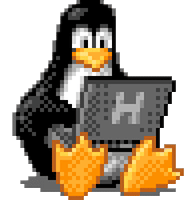

# Hi 👋, Im Nevio

**About me** 🪪

- Im currently in my first **Apprentice year as an IT technician** 🎓
- I love ❤️ computer sience 
- Im open for new stuff to lerarn ^^



---

<br>

## Skills 🔧

#### Programming 📂 :

- HTML
- CSS
- Python
- C#

#### Plattform 📂 :

- Knowlage with Basic Ntework Setup
- Basics Proxmox
- Debian/Ununtu
- Docker
- K8s

---

<br>

## Donation 💰

- **Monero (XMR) Address**
  ```bash
  47aKoLHj59oLYsYmbkqYpiNDJ6W4A4uJ6LRTmZud1ERJhkSRZ7nJaCqfbNX6b3mGPtcar4c2KWR5nBeuo46nXN8DUhtiuuJ
  ```
- **Bitcoin (BTC) Adress**
  ```bash
  bc1qszceh2tus3p350c2ur8pg7aklp2x8rknqae3gn
  ```


  
<!--
**Nevio-Source/Nevio-Source** is a ✨ _special_ ✨ repository because its `README.md` (this file) appears on your GitHub profile.

Here are some ideas to get you started:

- 🔭 I’m currently working on ...
- 🌱 I’m currently learning ...
- 👯 I’m looking to collaborate on ...
- 🤔 I’m looking for help with ...
- 💬 Ask me about ...
- 📫 How to reach me: ...
- 😄 Pronouns: ...
- ⚡ Fun fact: ...
-->
