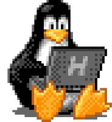

# Hi 👋, I'm Clavitus :3

**About me** 🪪

- I'm currently in my first **Apprentice year as an IT technician** 🎓
- I love ❤️ computer science 
- I'm open for new stuff to learn ^^



---

<br>

[My Website](https://clavitus.ch/)

<br>

## Donation 💰

- **Monero (XMR) Address**
  ```bash
  47aKoLHj59oLYsYmbkqYpiNDJ6W4A4uJ6LRTmZud1ERJhkSRZ7nJaCqfbNX6b3mGPtcar4c2KWR5nBeuo46nXN8DUhtiuuJ
  ```
- **Bitcoin (BTC) Adress**
  ```bash
  bc1qx7x3853qmqh0kgx567kn2n26e9rfufzj603whk
  ```


  
<!--
 is a ✨ _special_ ✨ repository because its `README.md` (this file) appears on your GitHub profile.

Here are some ideas to get you started:

- 🔭 I’m currently working on ...
- 🌱 I’m currently learning ...
- 👯 I’m looking to collaborate on ...
- 🤔 I’m looking for help with ...
- 💬 Ask me about ...
- 📫 How to reach me: ...
- 😄 Pronouns: ...
- ⚡ Fun fact: ...
-->
